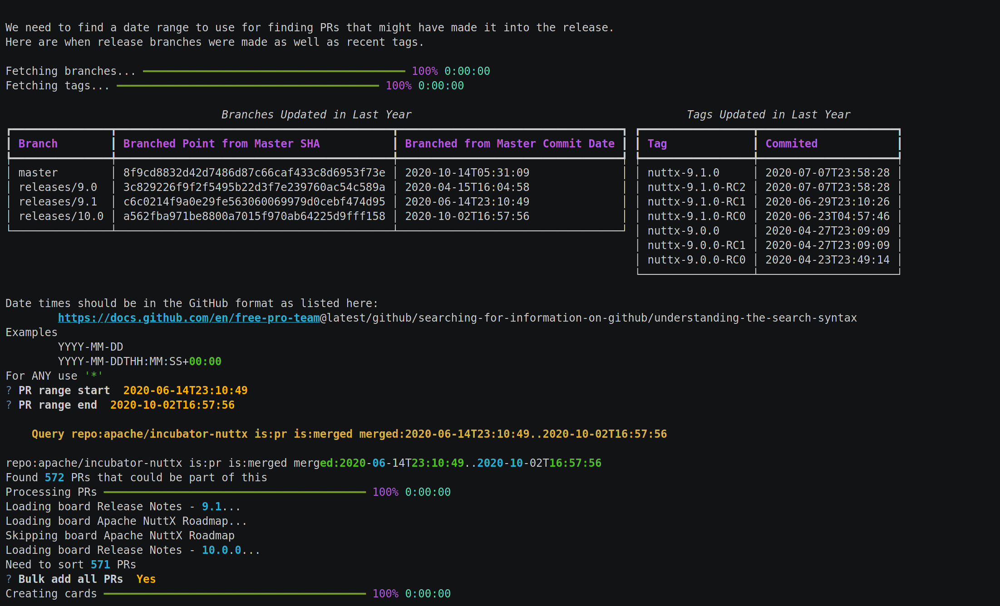

# NuttX Utilities


A collection of utilities to make maintaining Apache NuttX easier.

*NOTE*: This is ALPHA quality and everything will change and there is little
error handling.



Demos:
 * [Create a Release Board](https://asciinema.org/a/hNL94A2svS1QW9zQAWPx2ClyU)
 * [Triage Cards on a Release Board](https://asciinema.org/a/MUzG4aw2S2duFvxhZt6JbrlQP)

## Installation
This project is managed via [Poetry](https://python-poetry.org/)

To create the virtual environment and install: ```poetry install```

To activate the virtual environment ```poetry shell```

## Usage

*Note*: It is recommended to use a pager that supports ASCII colors. On Linux: `export PAGER="less -r"`

Base commands:
```
Usage: nxutils [OPTIONS] COMMAND [ARGS]...

Options:
  --help  Show this message and exit.

Commands:
  releasenotes
```

### **releasenotes**
```
Usage: nxutils releasenotes [OPTIONS]

Options:
  --github-token TEXT
  --repo TEXT
  --help               Show this message and exit.
```

This can be used to:
 * Create new project boards
 * Sync PRs to existing project boards
 * Triage PRs on project boards

The github token must have write permissions on the repo to be able to edit
the cards on the project board.

Syncing the PRs to the project board may take some time due to the GitHub API
and rate limiting.  600 PRs may take ~10min to complete.

### **triage**

There is a shortcut to triage seen in releasenotes as well:
```
Usage: nxutils triage [OPTIONS]

Options:
  --github-token TEXT
  --repo TEXT
  --help               Show this message and exit.
```
